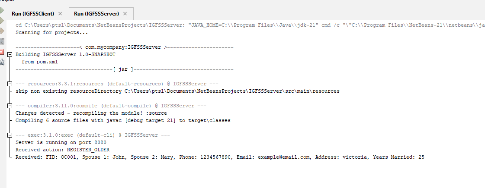
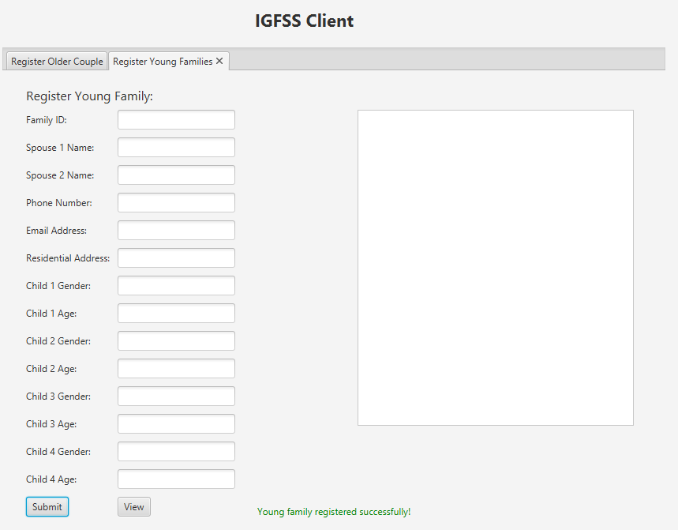

# Intergenerational-Family-Support-System
As part of the Happy Families program, CQ University Brisbane and Brisbane City Council collaborated to build the Intergenerational Family Support System (IGFSS), a prototype platform for community interaction. By facilitating member registration, event displays, and summary reporting, the system seeks to strengthen ties between young families and elderly couples (those who have been married for over 20 years). A Family Identification Number (FIDN) is assigned to each registered family, and all information is safely kept in a binary file. Members get access to specific contact information for communication as well as a list of registered families. The platform's future development and growth will depend on how well this prototype works

